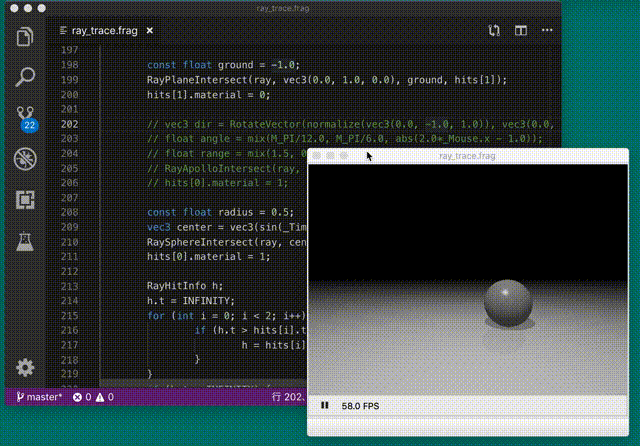

# shader-sandbox
**"shader-sandbox"** is just clone of [GLSL Sandbox](http://glslsandbox.com/). But it's Qt-based application written by C++.
The purpose is to build private environment to write shader.
The design of this renderer is very simple and is easy to customize.
So, I hope that other people will also use the repository as testbed for experimental coding.

